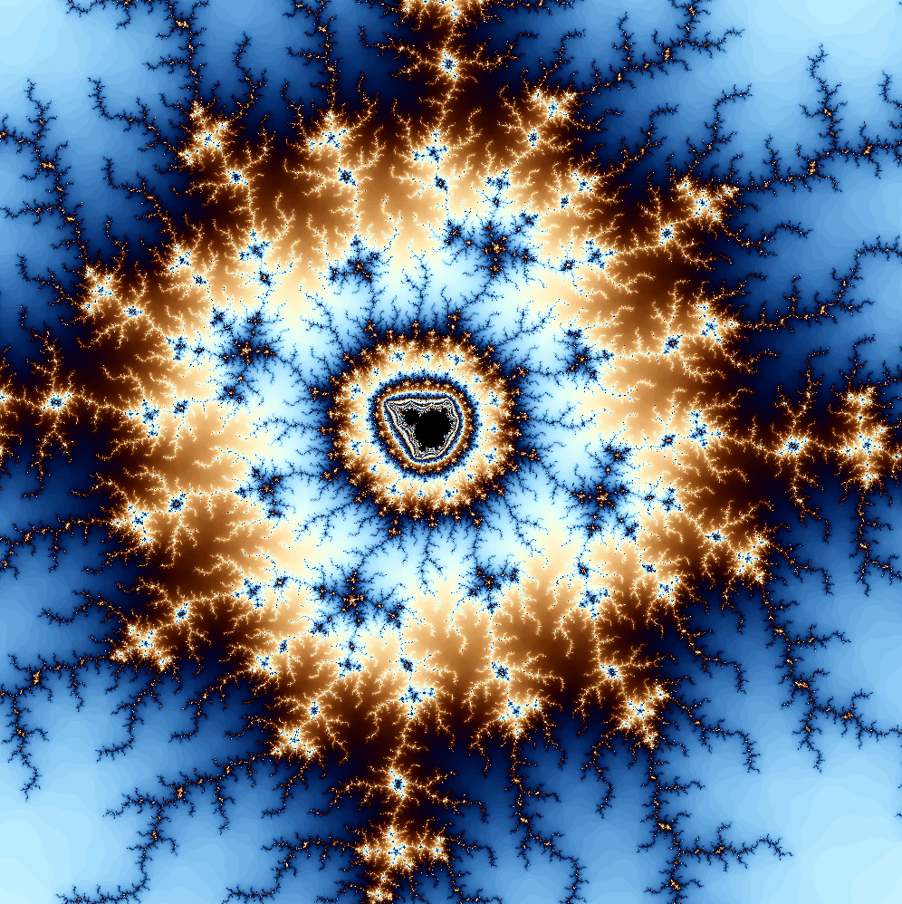

# The Mandelbrot set

The Mandelbrot set is the set of complex numbers c for which the function f(z) = z^2 + c does not diverge to infinity when iterated from z = 0. This application makes one able to explore the Mandelbrot set. 

## Authors

- [@Hansson00](https://github.com/Hansson00)

## Screenshots

## Features

- Zoom with L-Shift and L-Ctrl
- Increase fidelity with PgUp nad PgDn

## Deployment

To deploy this project
- Clone the project and open the version2 folder
- Open the .sln file in Visual Studio
- Compile for release or debug
- Run the executable under ./x64/Release

## FAQ

#### Question: Is version one still supported?

No, it was too messy and therefore a version 2 was developed.

## Roadmap

- Resizeing of window

- Addition of Julia sets

- Scaleable thread-pool

